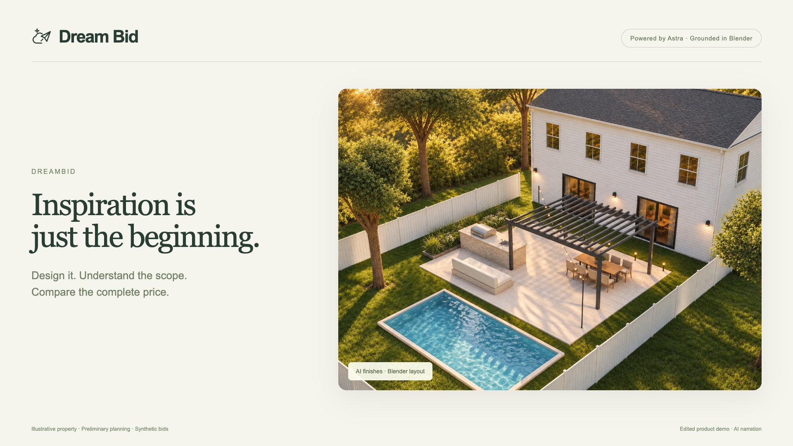
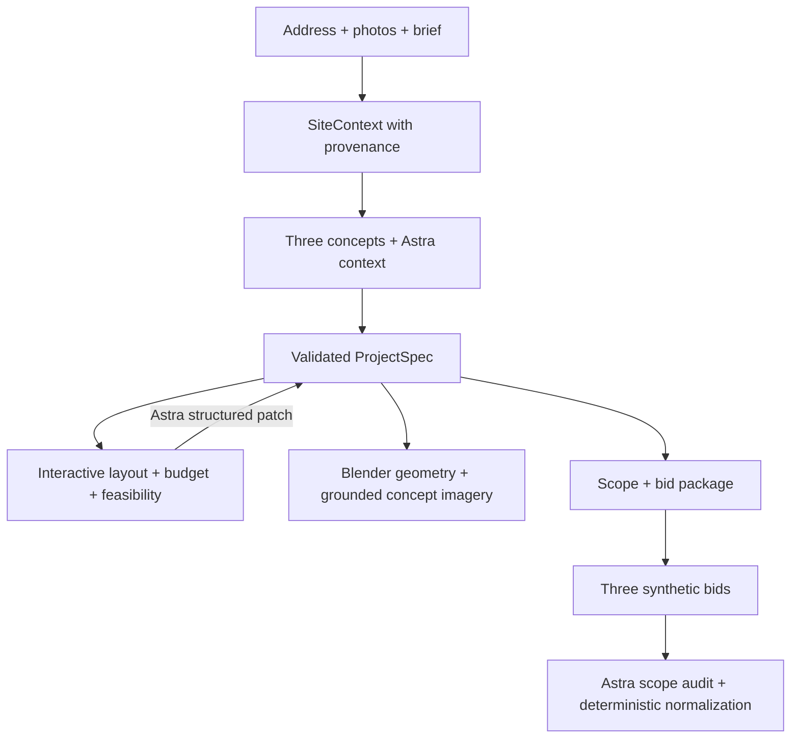

# DreamBid

[](https://dreambid-mocha.vercel.app/demo/dreambid-demo.mp4)

**[▶ Watch the 83-second demo](https://dreambid-mocha.vercel.app/demo/dreambid-demo.mp4)** · [Download MP4](https://github.com/fergushurley/dreambid/raw/refs/heads/main/public/demo/dreambid-demo.mp4)

*Watch the 83-second product walkthrough · AI narration · Recorded app interactions with edited API waits. Concept selection uses labeled demo playback; the budget edit and quote assessment use live Astra. [Transcript and recording details](docs/DEMO.md#recorded-product-walkthrough).*

**From address, to idea, to buildable project, to bid.**

DreamBid helps homeowners explore a backyard renovation, shape its layout and budget, and compare contractor proposals against the same scope. It connects visual inspiration to a structured project so the design, feasibility checks, and bid comparison stay together.

**[Try the hosted demo](https://dreambid-mocha.vercel.app/)** · [Run locally](#run-locally) · [Demo guide](docs/DEMO.md) · [Development log](docs/DEVELOPMENT.md)

Built from scratch for the GPT-6 Astra NYC Hackathon on September 10, 2026. This is a working prototype: installed prices are preliminary, contractor bids are synthetic, and feasibility is subject to professional verification.

## The experience

1. **Start with a property.** Enter a U.S. address, project goal and budget; optionally upload backyard photos. Review available imagery, source labels and unknowns before generating designs.
2. **Explore three directions.** Compare a simple refresh, an outdoor kitchen terrace and a poolside transformation. Each card's price comes from the scope that opens in the editor.
3. **Customize the selected layout.** Add features from a 31-item catalog, drag, resize, rotate or remove them. The preliminary installed range and feasibility warnings update immediately.
4. **Ask Astra to revise it.** Try “Keep the tree and get this under $75K.” Review structured substitutions and their budget impact before applying them to the same project.
5. **Preview and compare bids.** Inspect the current concept, Blender geometry and site plan. Resolve placement conflicts, export a bid package and compare three synthetic quotes—including work excluded from the cheapest headline price.

The fictional demo property is prefilled. Enable **Demo playback** for deterministic reasoning; leave it off to use a configured Astra API key. Live calls and fallbacks have distinct labels.

## Three designs, three levels of investment

The retained demo concepts deliberately differ in scope. They are curated starting points with Astra providing contextual reasoning and subsequent structured edits.

| Direction | Included scope | Preliminary installed range |
|---|---|---:|
| **The simple refresh** | Compact gravel terrace, dining for six, fabric shade sail, simple lighting and planting | **$12,330–$16,680** |
| **The kitchen terrace** | Stone dining terrace, cedar pergola, compact outdoor kitchen, layered lighting and planting | **$36,470–$49,340** |
| **The poolside retreat** | 24′ × 12′ pool, full outdoor kitchen, larger sandstone terrace, pergola, dining and lounge | **$108,660–$159,350** |

These USD ranges are curated planning assumptions, not contractor quotes or a nationwide pricing survey. The pool option stays visibly above a $50,000 budget. Moving a feature preserves its price; resizing adjusts size-dependent costs. [Tier scope and pricing](docs/CONCEPT_TIERS.md) · [Price formulas](docs/LAYOUT.md#price-model)

## Why Astra and Blender belong together

| Layer | Responsibility |
|---|---|
| **GPT-6 Astra** | Interpret the brief and supplied imagery, reason about context, propose validated project edits, explain tradeoffs and audit bid scope. |
| **ProjectSpec + SiteContext** | Shared TypeScript/Zod contracts for geometry, protected features, scope, budgets, revisions and source provenance. |
| **Deterministic code** | Calculate size-based prices, detect geometric conflicts, preserve hard constraints and normalize bid arithmetic. |
| **Blender** | Turn the same feature positions, dimensions and rotations into reproducible 3D geometry using authored Python. No model-generated code is executed. |
| **AI concept imagery** | Explore finishes, materials and atmosphere using property images or the matching demo Blender scene as references. |

The editor includes material and technical views, numeric dimensions, edge resizing, quarter-turn rotation and a corner remove control. Preliminary checks cover yard boundaries, house intersections, tree protection, stated setbacks, incompatible overlaps and door-clearance zones. Scope-linked quote comparison exposes excluded work and allowance shortfalls without double counting.

Layout changes invalidate outdated imagery and quotes. AI finish images are illustrative: reference grounding improves consistency but does not guarantee exact dimensions or pixel-perfect placement. Blender and the site plan retain the structured geometry. A labeled property photograph, an AI concept, a Blender render and a government aerial are different sources.

## Property context and its limits

- **Homeowner photos** are preferred for property-grounded analysis and visualization. Upload up to three JPG, PNG or WebP images.
- **Public data works without a Maps key.** Census address matching supplies an approximate location; USDA NAIP aerial imagery is retrieved through USGS where available. Images and facts retain source, retrieval and confidence information.
- **Matching an address does not verify the parcel.** The point can fall on a street or neighboring parcel. Aerial coverage and capture dates vary; this is not postal validation, measured lot geometry or authoritative nationwide property coverage.
- **Custom addresses do not inherit demo facts.** Unverified boundaries, house dimensions and rules remain assumptions or unknowns. Government/site-plan documents are supported by the context model; automated plan ingestion is not implemented.
- **Optional Google context is separate.** The integration supports Geocoding, Street View Static and Maps Static with a suitable server key. Google imagery is display-only in this implementation and is excluded from AI inputs and project persistence. The public-data path is the verified default.

The prefilled **24 Maple Lane, Montclair, NJ · demo property** is fictional. Its yard dimensions, oak protection zone and setbacks are illustrative fixtures, not municipal records. No view or warning constitutes permit approval. [Property grounding and verification](docs/PROPERTY_VISUALS.md)

## Run locally

Requires **Node.js 20.9+** and npm. Blender is optional for the retained demo assets and required to generate new local 3D scenes.

```sh
git clone https://github.com/fergushurley/dreambid.git
cd dreambid
npm install
cp .env.example .env.local
npm run dev
```

Open [http://127.0.0.1:3000](http://127.0.0.1:3000). The app uses webpack for development and production builds.

For live reasoning, add a funded `OPENAI_API_KEY` to `.env.local`. Without one, use **Demo playback**; failed API calls use a visibly labeled fallback or preserve the existing project with an error. Never commit `.env.local`.

| Setting | Purpose / default |
|---|---|
| `OPENAI_API_KEY` | Server-side key for live Astra and optional image generation |
| `OPENAI_MODEL` | `gpt-6-astra` |
| `OPENAI_IMAGE_MODEL` | `gpt-image-2`; concept regeneration is a separate paid image request |
| `DREAMBID_DEMO_MODE` | Set to `1` to force labeled deterministic playback |
| `DREAMBID_PROPERTY_PROVIDER` | `public`; optional `google` requires its own enabled APIs and server-compatible key |
| `BLENDER_PATH` | Blender executable; macOS default `/Applications/Blender.app/Contents/MacOS/Blender` |
| `BLENDER_TIMEOUT_MS` | Preview render timeout; default `60000` |

See [.env.example](.env.example) for optional provider and imagery-signing settings. Credentials remain on the server. Projects can resume from the same browser's local storage; uploaded photos are not persisted. JSON project and Markdown bid-package exports are available. There is no database, authentication, payment flow or real contractor outreach.

### Rendering and deployment

```sh
npm run smoke:blender
npm run render:property
node --import tsx scripts/render-tier-scenes.ts
```

Blender was verified with **5.2.1 LTS**. Authored scenes, procedural materials and furniture are in [blender/](blender/). Runtime renders and `.blend` files are cached under ignored `public/generated/`; retained demo assets ship in [public/demo/](public/demo/). Unavailable Blender renders fall back to a labeled plan. [Rendering quality and reproduction](docs/BLENDER_QUALITY.md)

The hosted Vercel demo serves the retained assets and server API routes. `/api/render` and `/api/visualize` use a **300-second** maximum compatible with Vercel Hobby. Vercel serverless does not bundle the local Blender executable: generating new Blender geometry requires the local setup. Property-grounded AI images can be returned directly without writing to the deployed filesystem. This is a hosted prototype, not a production rendering service.

## Architecture



| Location | Purpose |
|---|---|
| [types/](types/) | Shared validated project, layout, property, pricing and quote schemas |
| [fixtures/](fixtures/) | Demo property, concepts, feature catalog, prices and synthetic bids |
| [components/](components/) | Connected homeowner flow, layout editor and bid comparison |
| [lib/layout.ts](lib/layout.ts), [lib/feasibility.ts](lib/feasibility.ts) | Project patches, budget calculations and geometric checks |
| [lib/openai.ts](lib/openai.ts), [lib/layout-assistant.ts](lib/layout-assistant.ts) | Astra structured-output calls and constrained layout proposals |
| [lib/property-context.ts](lib/property-context.ts), [lib/property-grounding.ts](lib/property-grounding.ts) | Public/provider context and source-aware image inputs |
| [lib/render.ts](lib/render.ts), [lib/concept-visual.ts](lib/concept-visual.ts) | Blender rendering, image generation and invalidation |
| [lib/quotes.ts](lib/quotes.ts), [lib/bid-package.ts](lib/bid-package.ts) | Scope normalization and export |
| [app/api/](app/api/) | Concepts, project, revise, layout, quotes, render, visualize, property-context and property-image routes |

Stack: Next.js App Router, React, TypeScript, Tailwind, Zod, OpenAI Responses API and Blender Python.

## Verification

```sh
npm test
npm run typecheck
npm run build

# API smoke checks: keep the local app running
npm run smoke:flow
npm run smoke:layout
node --import tsx scripts/smoke-tiers.ts

# Optional live checks: funded API access required
npm run smoke:astra
npm run smoke:layout -- --live --visual
node --import tsx scripts/smoke-tiers.ts --live

# Public address/aerial check; --generate also invokes paid AI calls
node --import tsx scripts/smoke-property.ts
```

The latest application checkpoint passed **32 tests**, the production build and the canonical HTTP flow including a real Blender render. Coverage includes protected elements, geometry, price changes, stale state, property-source isolation and scope normalization. HTTP smoke checks write verification receipts; live outputs can differ from deterministic replay.

See [original live Astra evidence](docs/live-verification.json), [live layout verification](docs/layout-live-verification.json), [current tier verification](docs/tier-live-verification.json) and the [recorded walkthrough](docs/DEMO.md). These record observed runs, not latency or coverage guarantees.

## Project notes

- [Demo guide and narration transcript](docs/DEMO.md)
- [Interactive planning, price formulas and constraints](docs/LAYOUT.md)
- [Visual tiers and asset provenance](docs/CONCEPT_TIERS.md)
- [Public property context and photoreal grounding](docs/PROPERTY_VISUALS.md)
- [Submission text](docs/SUBMISSION.md) and [development history](docs/DEVELOPMENT.md)
- [Commercial hypothesis](docs/STRATEGY.md): a contractor sales and pre-construction workspace for outdoor-living remodelers. Subscription pricing and revenue targets are planning assumptions; billing and customer traction are not claimed.

DreamBid helps prepare a clearer project for professional scoping. Actual site measurements, engineering, local rules, utility conditions, contractor pricing and permits still need verification before construction.
